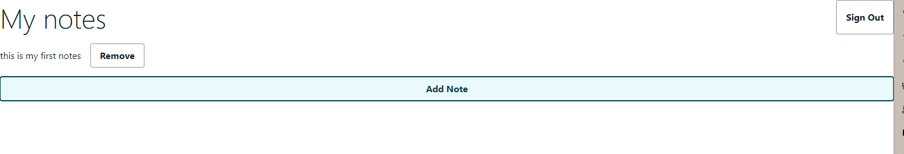
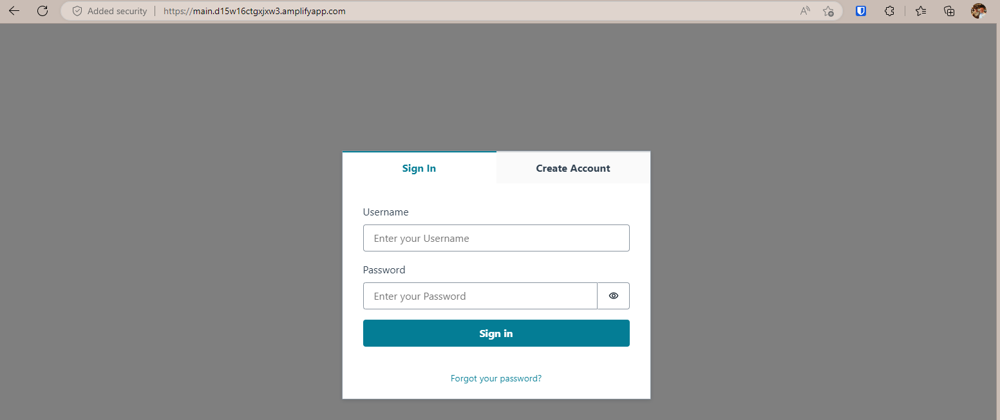
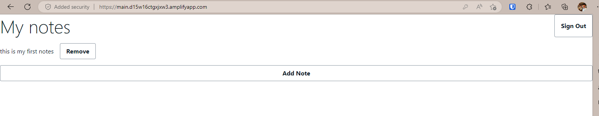
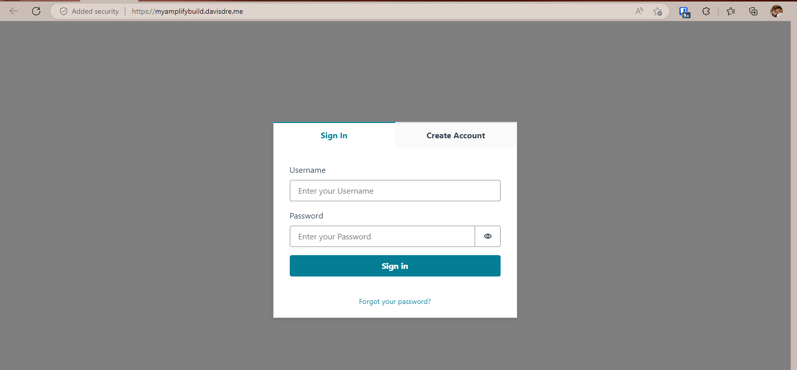

# Getting started with myamplifybuild

To get hands on with AWS Amplify. I'm using the AWS provided [Hands-On tutorial](https://aws.amazon.com/getting-started/guides/deploy-webapp-amplify/?ref=gsrchandson). This AWS tutorial walks a individual on how you could build a App in AWS Amplify and not have to worry about the infrastructure with this Serverless capability via AWS Amplify.

## Development box

As my development box, I'm using the Windows Subsystem for Linux (Ubuntu) on my Windows 11 machine. Doing it this way, you are able to continune learning about Linux and its importance to Cloud Computing. It also teaches you what is all involved as developer. 

### Step 1

- Add a [Create React App](https://github.com/facebook/create-react-app).
- Run `amplify init`.

### Step 2

- Add a GraphQL.
- Create a GraphQL Schema.
- Run `amplify push`.
- Test locally.

### Step 3

- Create GitHub repo.
- Push local code to newly created GitHub repo.
- Run `amplify add hosting`

## Final Product

Here is the final product:

## Going above and beyond

- [x] Connect a custom domain

- [ ]
- [ ]